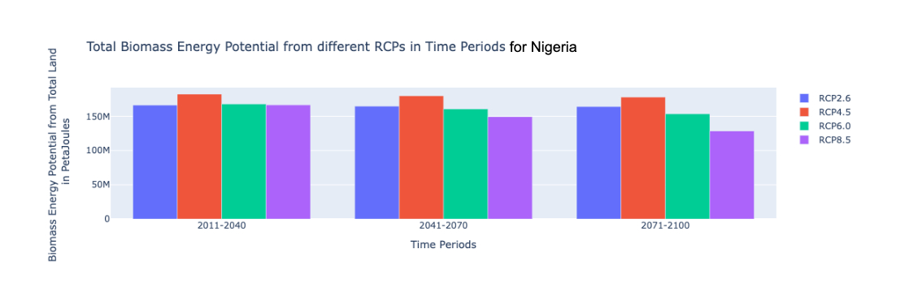

# Summary
Energy systems models (`ESMs`) use resource energy potentials as inputs to estimate the amount of energy that can be produced from a selected source of electricity generation. These energy potential numbers are spatially explicit in nature, specifically for renewable sources like solar, wind, hydropower and biomass. BEPMAT-The Biomass Energy Potential Mapping and Analysis Tool aims to estimate this (theoretical) energy potential from crop residues in a spatially explicit manner (up to province level detail per country). The outputs are provided for a baseline year and three temporal periods (2011-2040, 2040-2070, 2070-2100) under multiple representative concentration pathways (RCPs) from selected climate models. This tool, based on a jupyter notebook setup, will help Energy systems modelers to identify crops to grow on currently unused land and energy potential, and also estimate energy potential in crop residues from the land currently under crop cultivation. 

# Statement of Need 
There exist multiple open source tools that estimate the energy potentials for solar and wind <give sources for existing tools like Renewable ninja and solar and wind atlas>, however there exist a limited set of options for estimating the energy potential from biomass sources. Further more, most of them <give sources for existing tools> are not intuitive and difficult to use and not based on consistent data sources. `BEPMAT` is a tool aimed at bridging this gap by providing biomass energy potentials in a format that is easily assimilated into ESMs. `BEPMAT`, in addition to its primary objective, also provides the user the choice to specify the spatial dimension based on global administrative boundaries (gadm) and also the ability to choose crops that are the most suitable to grow within the selected boundaries. The tool also allows the user to download all the processed raw data in different formats <CSV, NETCDF4>. Structured with continuos text as part of a jupyter notebook, the tool also provides detailed maps as part of the output. Some examples have been provided to guide the users through the process.

# Data and Sources
All the crop specific data used by `BEPMAT` has been obtained from the Global Agro-Ecological Zoning database (GAEZ-v4), developed by FAOSTAT and IIASA <provide the main reference for GAEZ V4>. These include classification of the available land area into 57 Agro-Economic Zones, crop production values, Harvested Area, exclusion areas and tree Cover Shares for years 2000 and 2010. The potential crop yield numbers for the future under different RCPs and water supply options for selected climate models were also sourced from GAEZ-V4. The Pastureland dataset used is from Socioeconomic Data and Applications Center (SEDAC). The shapefiles (GADM boundaries) have been obtained using the python library gadm <provide the main reference>. The data for Residue-to-Product Ratio(RPR) ,the Surplus Availability Factor(SAF) and the Lower Heating Value(LHV) has been obtained from multiple academic journals detailed in the documentation.

# Methodology
<add the flow chart here>
The tool first identifies the total available land which can be used for growing crops. This is done by taking the whole area in the selected geography and excluding land utilisation types (LUTs) which are unfit for growing crops, we further remove protected areas, tree covered regions and water bodies. After this we are left with the total available land.This land is further split into two components : cropland and marginal land. The cropland is the land where the crops are currently being grown and we have assumed that this area remains constant throughout the analysis. However, the yield on this land changes with time, based on the climate, leading to different levels of crop production. Assuming the same crops grow on same chunks of land, we can obtain an estimate for the amount of energy that can be extracted from the cropland. Next we exclude this land from the total available land to find the remaining marginal land. On this marginal land, we iterate through a database of crops for their maximum agro-climatically attainable yield and select the best option. The yield of the chosen crop is multiplied by the area of marginal land to get the net production.

Post computing crop production values for the cropland and marginal land,  crop-specific factors (RPR, SAF and LHV) are used to deduce the final energy potential. RPR helps estimate the amount of residue produced from each kg of crop,  SAF aids in estimating the amount of residue that can be used for energy extraction purposes and finally LHV details the theoretical amount of energy we can obtain from a particular residue.

# Formulaes and Calculations <needs some work>

For a particular crop: \begin{equation}
\text{Theoretical Energy Potential} = \sum_{i} \text{Yield}_i \times \text{Area}_i \times \text{LHV}_i \times \text{SAF}_i \times \text{RPR}_i
\end{equation}
​
# Features

- The tool offers the ability to download all the data outputs in the form of NetCDF4 files.
- The tool also produces several interactive graphs which can be used to compare the energy potentials at a glance. The figures below illustrate them for selected geographies across the world
- The tool also allows for flexibility incase someone wants to change the RPR,LHV and SAF values to suit the region of their choice.
- Finally the Jupyter notebooks shows how the data in the generated arrays can be visualised using bokeh plots.
- The tool offers a variety of other features which are explained in detail in the jupyter notebooks and the attached supplementary documentation

# Potential Future Advancements
There is immense scope for further development of this tool and scope for adding various additional features which would make it better and more useful for a wider array of disciplines.A few of them are listed below.

- An additional economic layer could be added if the data for site-specific costs for crop residues can be identified. This will help us execute an optimisation routine that has the best cost to energy ratio in any region   
- There is scope for improving the output of the tool if site-specific values of RPR, SAF and LHV can be obtained.
- Currently the tool only outputs theoretical energy potential but energy conversion pathways can be added and the user can be enabled to select the different pathways and the net actual energy output can be calculated this way. 
-This is the first instance of the tool and at the moment the geographic capabilities of the tool is being improved by focussing on selected countries at greater spatial resolution.

# Figures <Move this section to features and make it into a flowing text>
Showcasing sample output results for total land (cropland + marginal land) of this tool for the countries : New Zealand and Nigeria
 

# Acknowledgements

This material has been produced with support from the Climate Compatible Growth (CCG) programme , which brings together leading research organizations and is led out of the STEER centre, Loughborough University. CCG is funded by UK aid from the UK government. However, the views expressed herein do not necessarily reflect the UK government’s official policies.

# References